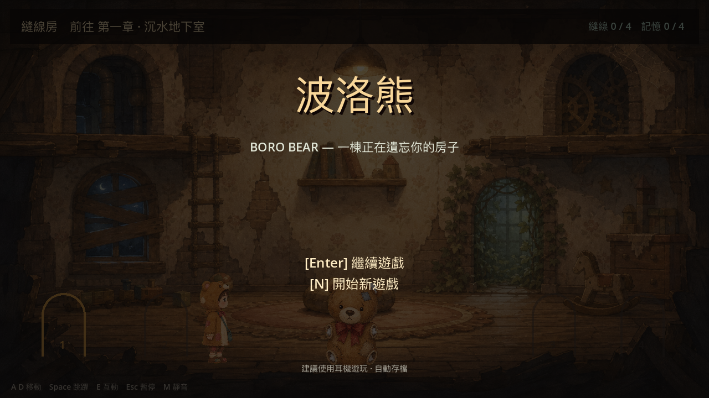
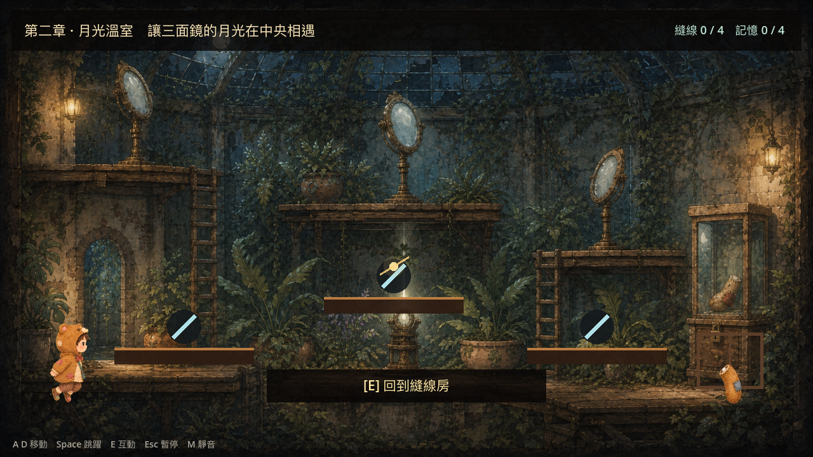
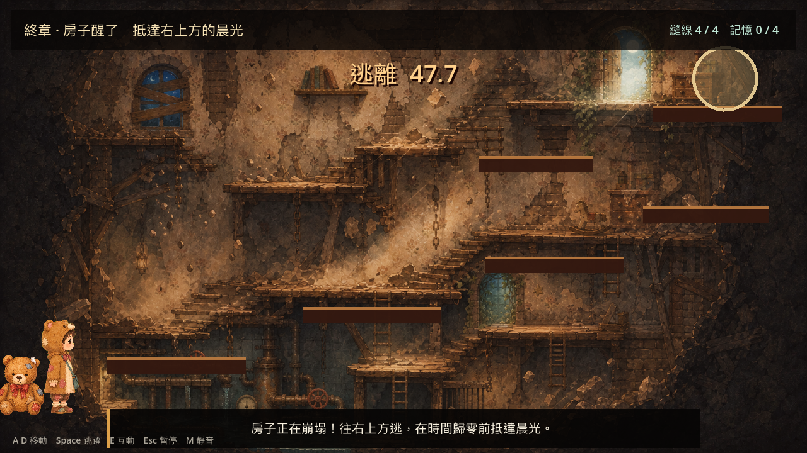

<div align="center">

<a href="https://ting-hong-shieh.github.io/boro-bear/">
  
</a>

<p>
  <a href="https://github.com/ting-hong-shieh/boro-bear/actions/workflows/pages.yml"></a>
  
  
  
</p>

<p><strong>四個房間、一隻破碎的熊，以及一棟正在崩塌的記憶之屋。</strong></p>

<p>
  <a href="https://ting-hong-shieh.github.io/boro-bear/"><strong>▶ 在瀏覽器遊玩</strong></a> ·
  <a href="README.md">English</a> · 繁體中文
</p>

</div>

**Boro Bear · 波洛熊：縫線房**是一款以 Godot 4.7 製作的 2D 短篇敘事解謎平台遊戲。
小眠在逐漸崩解的記憶之屋中遇見失去四肢的泰迪熊「波洛」。玩家需要解開每個房間的
機關，把波洛重新縫合，並在最後的倒數結束前抵達出口。

遊戲會在重要進度後自動存檔。每個房間還藏有一條「記憶線」；找齊四條才能開啟完整結局。

## 遊戲畫面

<table>
  <tr>
    <td width="50%"></td>
    <td width="50%"></td>
  </tr>
  <tr>
    <td align="center"><sub>月光溫室 · 鏡面謎題</sub></td>
    <td align="center"><sub>房子醒了 · 最終逃生</sub></td>
  </tr>
</table>

## 五段旅程

1. **沉水地下室**：閱讀壓力紀錄、設定三個水壓閥，取回左手。
2. **月光溫室**：理解三面鏡子的連動規則，匯聚月光後取回右手。
3. **沉默樂室**：依照紀錄重奏四個音盒，取回左腳。
4. **逆行鐘塔**：把三枚配重調整到金色目標刻度，取回右腳。
5. **房子醒了**：波洛修復完成後，在 48 秒內沿著崩塌樓梯抵達出口。

## 操作

| 動作 | 鍵盤 |
| --- | --- |
| 移動 | `A` / `D` 或方向鍵 |
| 跳躍 | `Space`、`W` 或 ↑ |
| 互動／推進對話 | `E` |
| 暫停 | `Esc` |
| 靜音 | `M` |
| 從暫停畫面回到標題 | `R` |
| 標題畫面繼續／新遊戲 | `Enter` / `N` |

### 手機網頁版

建議橫向遊玩。觸控螢幕或 coarse pointer 裝置會顯示操作按鈕：左下角控制移動，
右下角負責互動與跳躍，右上角可暫停。加入主畫面後可以全螢幕開啟。

## 本機執行

使用 Godot 4.7.x 匯入 repository，開啟 `project.godot` 後按 `F6` 或 `F5`。

```sh
godot --path . --editor
```

若要在本機匯出 Web 版本，請先安裝 Godot 4.7.1 export templates：

```sh
mkdir -p build/web
godot --headless --path . --export-release Web build/web/index.html
```

每次 push 到 `main`，GitHub Actions 都會重新匯出並部署至 GitHub Pages。

## 開發者檢查

啟動個別章節：

```sh
godot --path . -- --debug-basement
godot --path . -- --debug-greenhouse
godot --path . -- --debug-music_room
godot --path . -- --debug-clocktower
godot --path . -- --debug-escape
```

以 headless 模式執行完整流程與物理檢查：

```sh
godot --headless --path . -- --debug-full-flow
godot --headless --path . -- --debug-physics-test
```

流程檢查會依序驗證四個謎題、四次修復、逃生與完整結局。物理檢查則以模擬按鍵驗證
平台下方通行、單向平台、可達跳躍高度與左右邊界牆。

## 專案結構

- `scenes/`：主場景與玩家場景；
- `scripts/game.gd`：章節、謎題、對話、UI、逃生與結局；
- `scripts/game_state.gd`：跨章節狀態與 JSON 存檔；
- `scripts/player.gd`：移動、跳躍、動畫與腳步聲；
- `art/`：概念圖、角色動畫、模組化波洛素材與預覽圖；
- `audio/`：遊戲使用的音樂與音效；
- `third_party/`：第三方素材與隨附授權。

遊戲以 1280 × 720 為設計基準，使用 Godot GL Compatibility renderer。
素材來源與授權詳見 [THIRD_PARTY_NOTICES.md](THIRD_PARTY_NOTICES.md)。
